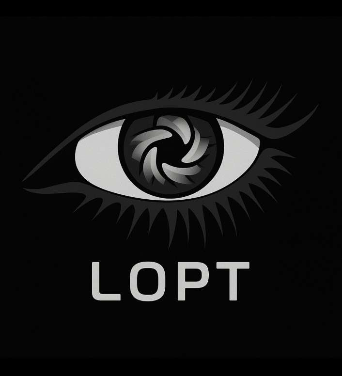

**<h1 align="center">LOPT: Advanced Deepfake Classification Framework</h1>**

<p align="center">
  
</p>

  
<div align="center">

[](https://www.python.org/)
[](https://reactjs.org/)
[](https://fastapi.tiangolo.com/)
[](https://www.typescriptlang.org/)
[](https://vitejs.dev/)
[](https://pytorch.org/)
[](https://huggingface.co/transformers/)
[](https://huggingface.co/agasta/virtus)
[](LICENSE)
[](https://github.com/Itz-Agasta/lopt/pulls)
[](https://github.com/Itz-Agasta/lopt/issues)
[](https://github.com/Itz-Agasta/lopt/stargazers)
[](https://github.com/Itz-Agasta/lopt/commits/main)

</div>

  <p align="center">
  Lopt is a multi-modal deepfake classification framework leveraging transformer-based architectures for high-confidence media authentication. It integrates ViT and TimeSformer models for  classifications, optimized via stratified training, augmentation, and parameter-efficient fine-tuning. Built for real-world robustness, Lopt supports scalable inference through a FastAPI backend and offers a React-powered UI for streamlined interaction. 
    <br />
    <br />
    <a href="https://www.youtube.com/watch?v=E1AjSHxe5NU&feature=youtu.be">View Demo</a>
    .
    <a href="https://github.com/Itz-Agasta/lopt/issues">Report Bug</a>
    ·
    <a href="https://github.com/Itz-Agasta/lopt/issues">Request Feature</a>
    ·
    <a href="https://github.com/Itz-Agasta/lopt/pulls">Send a Pull Request</a>
  </p>

## What Are Deepfakes — and Why Should You Care?

Deepfakes are AI-generated media — often hyper-realistic videos or images — where a person’s face, voice, or identity is altered or replaced with another. Initially a byproduct of generative research (e.g., GANs and diffusion models), deepfakes have rapidly evolved from novelty to existential threat.

> 📉 Implications: Misinformation, digital harassment, political manipulation, identity theft, and erosion of public trust.


*<p align="center">A screenshot comparing a real video of President Barrack Obama with a deepfaked version, Jul. 2019 (Youtube/UC Berkeley/https://youtu.be/51uHNgmnLWI/CC Reuse Allowed)</p>*

As synthetic content becomes increasingly indistinguishable from authentic media, we need machine learning models that can see what humans no longer can.

## Meet Lopt

Lopt is a multimodal deepfake detection framework designed to analyze and classify images and videos as `Real` or `Fake`. It combines:

- **ViT-based** architectures for image classification

- **TimeSformer-based** models for video understanding

- Clean and reproducible pipelines for training, evaluation, and deployment

- Full-stack implementation for both research and real-world use

## Project Overview

This project implements two complementary models for deepfake detection:

1. **Virtus**: A Vision Transformer (ViT) based model for image-level deepfake detection with binary classification head.

   - `Base Model:` [facebook/deit-base-distilled-patch16-224](https://arxiv.org/abs/2012.12877)
   - `Dataset:` [~190k labeled samples across real/fake images](https://drive.google.com/drive/folders/1UksPJfRtgw_fLsGcpCRAEWSyt_5fSA9Y?usp=sharing)
   - `Results:`
     - Accuracy: 99.20%
     - Macro F1 Score: 0.9920
     - Evaluated using classification reports and confusion matrix
   - Inference Ready: Deployed to Hugging Face 🤗 [agasta/virtus](https://huggingface.co/agasta/virtus)

2. **Scarlet**: A TimeSformer-based architecture for video-level deepfake analysis with memory-efficient Temporal attention mechanism.

- `Base Model:` [facebook/timesformer-base-finetuned-k400](https://huggingface.co/facebook/timesformer-base-finetuned-k400)
- `Dataset:` [FaceForensics++](https://github.com/ondyari/FaceForensics)
- `Results:` - Accuracy: 96% - Macro F1 Score: 0.958 - Evaluated using classification reports and confusion matrix
- Inference Ready: Deployed to Hugging Face 🤗 [agasta/scarlet](https://huggingface.co/agasta/scarlet)


*<p align="center">Comparative evaluation of deepfake detection performance across modern and legacy models.</p>*

The framework is designed to be modular, allowing for easy integration of new models, datasets, evaluation metrics or with other projects.
You can load the model into your project using:

```python
from transformers import AutoModelForImageClassification, AutoFeatureExtractor

model = AutoModelForImageClassification.from_pretrained("agasta/virtus")
extractor = AutoFeatureExtractor.from_pretrained("agasta/virtus")
```

It also provides a user-friendly interface for uploading and analyzing media files. For full training code, dataset
preprocessing, and evaluation metrics, check the [Virtus model README](./models/image/README.md)
& [Scarlet model README](./models/video/README.md)

## Architecture

Lopt is structured as a modular ML system built for fast inference, responsive UX, and scalable deployment.
It integrates a RESTful backend, transformer-based inference engines, and a frontend interface — all wired together
via clean API boundaries.

### System Overview


*<p align="center">Fullstack System Architecture</p>*


### Request Lifecycle:

1. **Media Upload (Frontend)**

   - Built with React and TailwindCSS, Users select or drag-and-drop an image or video
   - `Axios` sends a `POST` request to `/playground`endpoint with the media as multipart/form-data

2. **Backend Routing (FastAPI)**

   - FastAPI handles the `/playground` route asynchronously
   - Payload is validated and temporarily saved or streamed in-memory
   - Inference logic branches based on file MIME type (image/, video/)

3. **Model Inference Pipeline**

   - Transformer models are pre-loaded and cached using Hugging Face’s `AutoModelForImageClassification` or `AutoModelForVideoClassification`
   - Corresponding processors handle resizing, normalization, and tensor conversion (ViTImageProcessor)
   - Inputs are batched and pushed through the model with `torch.no_grad()` to ensure fast, memory-safe execution

4. **Output Generation**

   - Model logits are passed through softmax to generate class probabilities
   - Top predicted class is mapped back using `config.id2label`
   - Output is serialized into a response payload:

   ```json
   {
     "type": "image",
     "label": "Fake",
     "confidence": 0.9912
   }
   ```

5. **Frontend Display**
   - Response is parsed and rendered in the UI with color-coded tags and animation feedback
     > Future Note: will include saliency maps, Grad-CAM visualizations, and image overlays for transparency

### Model Caching Strategy:

- Models (Virtus, Scarlet) are loaded on server startup and held in-memory via Python singleton pattern, module scope
- Avoids repeated `from_pretrained()` calls, reducing cold start latency
- Torch is placed in `eval()` mode with disabled gradients for optimal performance
- Devices auto-detect (CPU/GPU) with planned support for `ONNX` and `TensorRT acceleration`

### Tech Stack Overview:

| Layer          | Tech Used                                                                                                |
| -------------- | -------------------------------------------------------------------------------------------------------- |
| **Backend**    | Python, FastAPI, Uvicorn, Pillow, Torch-cpu, Torchvision-cpu, Transformers, Opencv                       |
| **Frontend**   | JavaScript, React, Tailwind, Vite, Framer Motion, Lenis Smooth Scroll                                    |
| **Models**     | PyTorch, Hugging Face, Transformers, Scikit-learn, Imbalanced-learn, Accelerate, Pillow, Virtus, Scarlet |
| **Training**   | Kaggle Accelerators + 🤗 Hub                                                                             |
| **Management** | UV, npm, pytest, Pydantic v2, Ruff                                                                       |
| **DevOps**     | Docker, GitHub Actions, GCP, AWS                                                                         |

## Repository Structure

```bash
lopt/
├── frontend/
│   ├── public/                # Static files
│   ├── src/
│   │   ├── components/        # Reusable UI components
│   │   ├── pages/             # Page-level components
│   │   ├── hooks/             # Custom React hooks
│   │   ├── services/          # API service layer
│   │   ├── styles/            # CSS/styled-components
│   │   ├── App.jsx            # Main app logic
│   │   └── index.jsx          # Entry point
│   ├── .env                   # Frontend environment config
│   ├── package.json
│   └── README.md

├── backend/
│   ├── app/
│   │   ├── api/
│   │   │   └── endpoints/     # Route handlers (upload.py, job.py, health.py)
│   │   ├── models/
│   │   ├── services/
│   │   ├── main.py            # Entry point for FastAPI app
│   │   └── __init__.py
│   ├── tests/                 # Backend tests
│   ├── Dockerfile             # Backend container definition
│   ├── Pyproject.toml         # Python dependencies
│   └── README.md
│
├── models/
│   ├── Virtus              # Image-based deepfake detection model
│   ├── Scarlet             # Video-based deepfake detection model
│   └── README.md
│
├── .gitignore
├── README.md
└── LICENSE
```

## Installation Guide

<details>
  <summary>Prerequisites</summary>

- **Python**: Ensure Python 3.12 or higher is installed. You can download it from [python.org](https://www.python.org/downloads/).
- **Node.js**: Install Node.js (v19.0.0 or higher) and npm for the frontend.
- **[UV](https://docs.astral.sh/uv/getting-started/installation/)**: Ensure UV is installed for managing Python dependencies.
- **Git**: Install Git to clone the repository.
- **Docker**: For easy container builds.

</details>

### Step 1: Clone the Repository

```bash
git clone https://github.com//Itz-Agasta/lopt.git
cd lopt
```

### Step 2: Set Up the Frontend

1.  Install Frontend Dependencies:

```bash
cd frontend
npm install
```

2.  Build the Frontend:

```bash
npm run build
```

### Step 3: Set Up the Backend

1.  Install Python Dependencies:

```bash
cd backend
uv sync
```

### Step 4: Run the Application

1.  Start the Backend:

```bash
uv run fastapi dev
```

2. Start the Frontend:

```bash
npm run dev
```

3. Access the application at http://localhost:3000.

### Step 5: Verify Installation

- Test the backend by visiting http://localhost:8000/docs for the FastAPI Swagger UI.
- Test the frontend by uploading an image or video for classification.

## Contributors

<a href="https://github.com/Itz-Agasta/lopt/graphs/contributors">
  
</a>

## 📚 Citations

Lopt draws inspiration from key foundational papers in the deepfake detection space:

- 📄 **FaceForensics++**  
  _Rossler et al., ICCV 2019_  
  [https://arxiv.org/abs/1901.08971](https://arxiv.org/abs/1901.08971)

- 📄 **Exposing DeepFakes Using Inconsistent Head Poses**  
  _Yang et al., CVPRW 2019_  
  [https://arxiv.org/abs/1811.00661](https://arxiv.org/abs/1811.00661)

- 📄 **TimeSformer: Attention Is All You Need for Video Understanding**  
  _Bertasius et al., 2021_  
  [https://arxiv.org/abs/2102.05095](https://arxiv.org/abs/2102.05095)

- 📄 **Training Vision Transformers for Deepfake Detection**  
  _Nasrullah et al., NeurIPS 2022_  
  [https://arxiv.org/abs/2210.08174](https://arxiv.org/abs/2210.08174)

## License

This project is licensed under the [MIT License](https://github.com/Itz-Agasta/lopt/blob/main/License). See the LICENSE file for more details.

Feel free to Send a [Pull Request](https://github.com/Itz-Agasta/lopt/pulls) if you have improvements or fixes.
For questions or feedback, please open an issue or contact [rupam.golui@proton.me](mailto:rupam.golui@proton.me)
